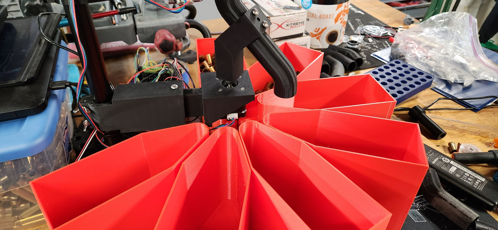

# Experimental
Stuff in this folder is in the process of being tested/refined. 

### Sorter Minimal Design
This design eliminates the sorter plate and piping. It features an adjustable motor/sorter arm mount. 
Recommend printing in PLA+ at layer height of .24mm with infill no less than 15%. Supports are required and recommendation is support overhang angle of 80 degrees. 

* SorterMinimalDesign (Includes both sides of mount)
* SorterMinimalDesign_MotorSide (the side which motor attaches to)
* SorterMinimalDesign_PoleSide (the side which attaches to the pole)

### Here is an example of what it looks like:
